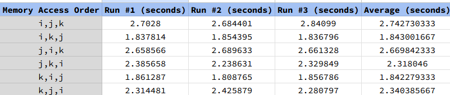
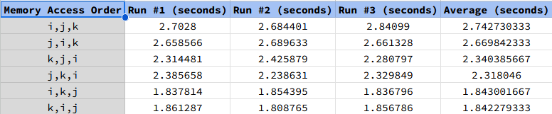

# Homework 1: Locality

## Author: Ashwin Pai

Results from running HW1 Benchmark

### Explanation
The C programming language uses row-major ordering. This means that row elements are stored contiguously in memory. This allows for better cache locality and fewer cache misses when row elements are accessed.

The above image is the same data as initially shared but ranked from fastest to slowest.

#### Worst Case
The worst Memory Access Order (MAO) was I, J, K at 2.74 seconds. In this example, K is the innermost loop, which causes the program to jump across columns. This leads to a new row of B being fetched for every K iteration, which results in frequent cache misses and increased processing time. Spatial locality is poor for both A and B.

#### Best Case(s)
The best MAO cases were I, K, J and K, I, J at 1.84 seconds respectively. In both of these versions, memory is accessed in a row-major fashion, leading to better cache reuse. Both of these examples maximize cache reuse for A, B, and C, resulting in fewer cache evictions and increased performance.

#### Remaining Examples
- J, I, K MA: C is accessed column-wise, which is bad for cache hits and program performance.
- J, K, I & K, J, I MAO: C is still accessed column-wise, which negatively affects performance. However, these cases are slightly better than J, I, K because A is accessed row-wise, benefiting from cache locality. These cases are faster than J, I, K** because B stays in the cache longer.
